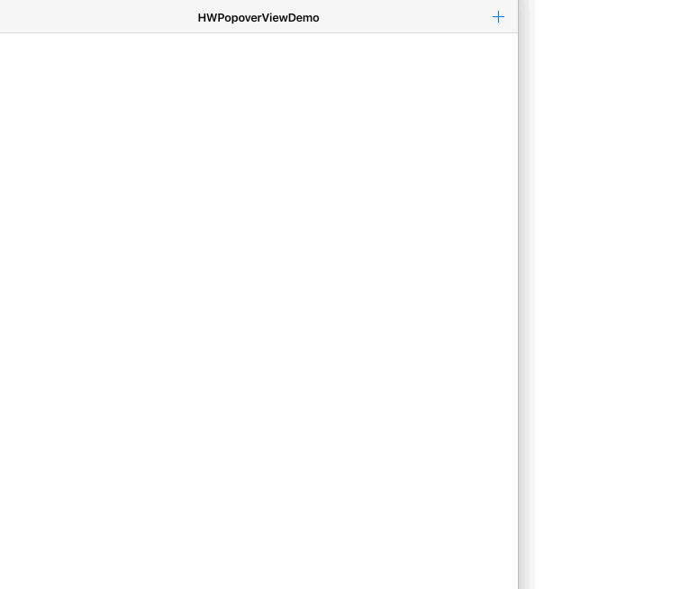

# HWPopoverViewDemo

 




### Requirements

* iOS 7.0 or later
	

### How To Use

```
	NSArray *titles = @[@"添加好友",@"多人会话",@"扫一扫"];
    NSArray *icons = @[@"right_menu_addFriend",@"right_menu_multichat",@"right_menu_QR"];
    self.popoverView = [[HWPopoverView alloc] initWithTitles:titles icons:icons style:HWPopoverViewStyleRightTop didSelectCallBack:^(NSInteger selectIndex) {
        NSLog(@"-->> selectIndex:%ld", (long)selectIndex);
    }];

```

### Installation
 
Podfile

```
pod 'HWPopoverView'
```

Complete the installation by executing:

```
$ pod install
```

##### Import headers in your source files

In the source files where you need to use the library, import the header file:

```
#import "HWPopoverView.h"
```

